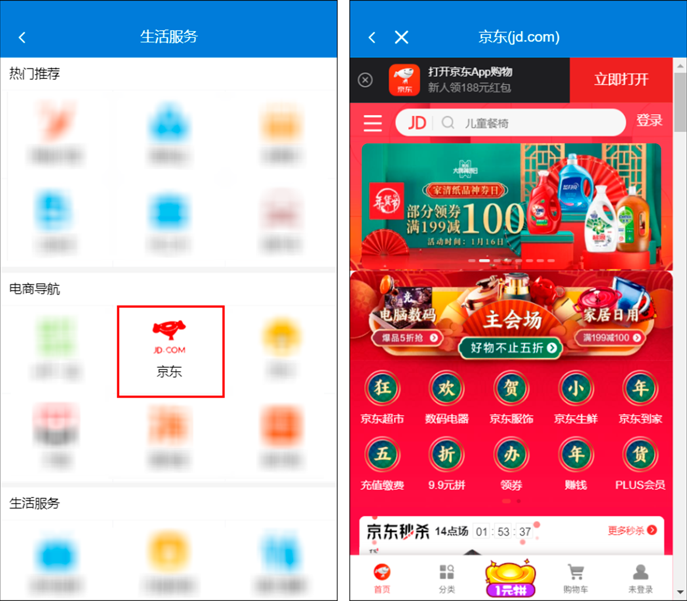

### 1.前言

> 在 web 页面开发中，常常会有这样的需求：<br>
>
> &emsp;&emsp;**在当前页面内打开一个外部页面。**<br>
>
> &emsp;&emsp;如果仅仅是跳转到外部页面，对于有经验的开发者来说，应该没有什么难度。但常常，需要打开的页面仅仅是当前已有页面的一部分，即需要嵌套到当前页面内，往往就不太好实现了。

### 2.解决方案

使用 **iframe** 加载外部页面。

html 页面内嵌套 iframe，并将 iframe 的 src 属性绑定为目标外部页面链接。

```
 <div id="iframe-container">
      <iframe :src="iframeSrc" scrolling="auto" frameborder="0" id="iframe"></iframe>
  </div>
```

### 3.示例

**需求：** 点击电商导航内菜单，打开相应页面，在新开页面中，显示页面加载状态，可以回退和直接关闭新开页面。



**分析：**

- 图一和图二顶部样式不一致，因此，是两个独立的组件。
- 点击图一页面中的菜单，跳转到图二页面，需要配置路由。
- 如何传递外部页面的地址？路由传参？vuex?

**实现：**
&emsp;&emsp;Tips： 本例基于 vue + vue-router + vuex + vant 实现

图一页面布局：

```
 <div class="module-box">
      <div class="module-title">电商导航</div>
      <van-grid :column-num="3">
          <van-grid-item v-for="(item,index) in eShopNavItems"
                         :key="index"
                         :icon="item.iconPath"
                         :text="item.name"
                         @click="gotoPage(item.path)" />
      </van-grid>
 </div>
```

js 部分：

```
<script>
export default {
  components: {},
  props: {},
  data() {
    return {
      eShopNavItems: [
        {
          name: '京东',
          iconPath: require('../../../assets/images/lifeServices/index/jd.png'),
          path: '/home/lifeServices/jd',
        },
        <!-- 其他菜单配置 -->
      ]
    }
  },
  methods: {
    onClickLeft() {
      this.$router.go(-1)
    },

    gotoPage(path) {
      this.$router.push(path)

      <!-- 存储目标外链的url及要显示的标题 -->
      <!-- 这部分写在路由配置里的meta参数下 -->

      this.$store.state.iframeSrc = this.$route.meta.link
      this.$store.state.iframeTitle = this.$route.meta.title
    }
  }
}
</script>

```

路由配置：

```
const routes = [{
  path: '/home/lifeServices/externalLink',
  name: 'externalLink',
  component: LinkHome,
  children: [
    {
      path: '/home/lifeServices/jd',
      meta: {
        link: 'https://m.jd.com/',
        title: '京东(jd.com)'
      }
    },
];
```

接下来关键的实现，也是最核心的点在于“LinkHome”组件的实现。

LinkHome.vue

```
<template>
  <div class="link-home">
    <div class="header">
      <van-nav-bar
        :title="$store.state.iframeTitle"
        left-arrow
        @click-left="onClickLeft"
      ></van-nav-bar>
      <van-icon name="cross" class="close" @click="closeTab" />
    </div>

    <div id="iframe-container">
      <iframe :src="$store.state.iframeSrc" scrolling="auto" frameborder="0" id="iframe"></iframe>
    </div>
  </div>
</template>

<script>
import NProgress from 'nprogress'

export default {
  mounted() {
    let iframe = document.getElementById('iframe')
    NProgress.start()

    iframe.onload = function() {
      NProgress.done()
    }
  },
  methods: {
    onClickLeft() {
      this.$router.go(-1)
      NProgress.done()
    },

    closeTab() {
      this.$router.replace('/home/lifeServices/index')
      NProgress.done()
    }
  }
}
</script>

<!-- css样式省略 -->

```

给 iframe 的 src 属性绑定值，且为目标外部页面地址。即可嵌套加载外部页面。

页面加载状态使用[NProgress](https://github.com/rstacruz/nprogress)。

在 vue.js 的 mounted 生命周期内，开始加载进度条。

```
NProgress.start()
```

获取 iframe 元素，当 iframe 页面加载完成后，关闭进度条。

```
iframe.onload = function() {
  NProgress.done()
}
```

当后退或者关闭当前页面时，也应该一并关闭进度条提示。因为当页面还没有加载完时，后退或者关闭页面，将会导致进度条一致存在。

**特别提示:** 关闭页面，即回到主页时，应使用 **`this.$router.replace`** 而不是 `this.$router.push`，这两个同样是跳转到指定的 url，但是 `this.$router.replace` 不会向 history 里面添加新的记录。回到主页，再后退，应该是回到进入主页的上一个页面，而不是刚才打开的外部页面。
